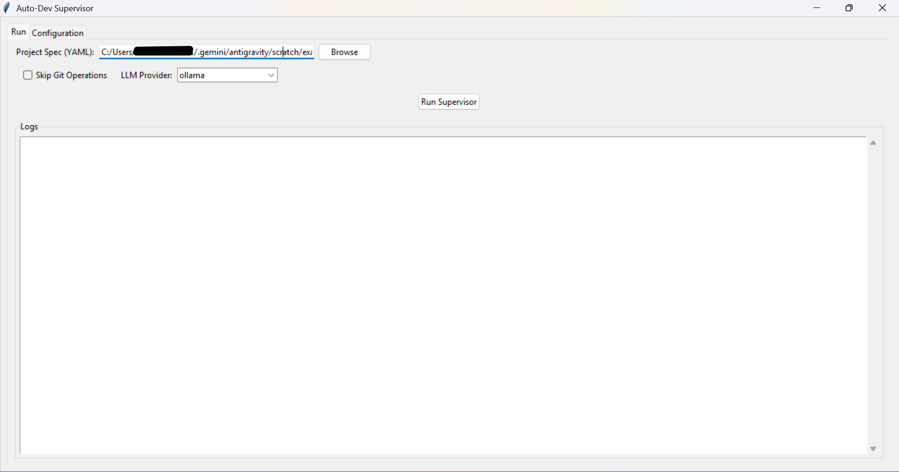

# Autonomous Developer Supervisor (`auto-dev`)

A production-grade Autonomous Developer Supervisor Application that controls OpenDevin (or LLMs) like a real software developer employee.

## 📚 Documentation

- **[User Guide](docs/USER_GUIDE.md)**: Detailed setup, configuration, and usage instructions.
- **[Architecture](docs/ARCHITECTURE.md)**: System design and component overview.

## ✨ Features

- **Managerial Role**: Accepts YAML project specs and plans tasks.
- **Iterative Development**: PLAN -> IMPLEMENT -> BUILD -> TEST -> QA -> FIX -> COMMIT -> PUSH.
- **Dockerized Environments**: Builds and tests apps in isolated containers.
- **ML/Audio QA**: Enforces quality metrics (MCD, SNR, MOS) for AI apps.
- **Git Automation**: Commits only stable code with detailed messages.
- **GenAI Integration**: Uses LLMs (OpenAI, Gemini, Grok, Anthropic) to write and fix code.
- **Flexible Workflow**: Supports `--skip-git` for local experimentation.
- **GUI Interface**: User-friendly desktop application for easy configuration and monitoring.
- **Enhanced Error Handling**: Intelligent error recovery and fallback mechanisms.
- **Real-time Progress Monitoring**: Live updates and progress tracking.
- **Automated Testing Pipeline**: Comprehensive test execution and validation.
- **Multi-LLM Support**: Switch between different AI providers seamlessly.
- **Local Model Support**: Integration with Ollama for local AI models.

## 🚀 Quick Start

### Prerequisites

- **Python 3.8+** and **Poetry** (dependency manager)
- **Docker** and **Docker Compose** (for containerized builds)
- **Git** (for repository management)
- **Ollama** (optional, for local AI models)

### Installation

```bash
# Clone the repository
git clone <repository-url>
cd auto-dev-supervisor

# Install dependencies
poetry install

# Verify installation
poetry run auto-dev --help
```

### GUI Mode (Recommended for Beginners)

1. **Launch GUI**:
   ```bash
   poetry run auto-dev gui
   ```
   

2. **Configure API Keys** in the GUI (Configuration tab)
3. **Select Project Spec** (YAML file)
4. **Choose LLM Provider** and model
5. **Click Run Supervisor** and monitor progress

### CLI Mode (Advanced Users)

#### Basic Commands

```bash
# Run with Mock provider (free testing)
poetry run auto-dev run examples/simple_app.yaml

# Run with specific provider
poetry run auto-dev run examples/simple_app.yaml --llm-provider openai

# Run with custom model
poetry run auto-dev run examples/simple_app.yaml --llm-provider ollama --model llama3.1

# Skip git operations (for local testing)
poetry run auto-dev run examples/simple_app.yaml --skip-git

# Run with verbose logging
poetry run auto-dev run examples/simple_app.yaml --verbose
```

#### Advanced Options

```bash
# Set project root directory
poetry run auto-dev run examples/simple_app.yaml --project-root ./my-project

# Configure maximum retries for auto-fixing
poetry run auto-dev run examples/simple_app.yaml --max-retries 5

# Combine multiple options
poetry run auto-dev run examples/advanced_calculator.yaml \
  --llm-provider gemini \
  --model gemini-1.5-flash \
  --skip-git \
  --verbose \
  --max-retries 3
```

## 🔧 Configuration

### API Keys Setup

Set up your API keys for different providers:

```bash
# OpenAI
export OPENAI_API_KEY="sk-your-openai-key"

# Gemini (Google AI)
export GEMINI_API_KEY="your-gemini-key"

# Grok (xAI)
export GROK_API_KEY="your-grok-key"

# Anthropic (Claude)
export ANTHROPIC_API_KEY="your-anthropic-key"
```
 
Windows PowerShell:

```powershell
# OpenAI
$env:OPENAI_API_KEY = "sk-your-openai-key"
# Gemini
$env:GEMINI_API_KEY = "your-gemini-key"
# Grok
$env:GROK_API_KEY = "your-grok-key"
# Anthropic
$env:ANTHROPIC_API_KEY = "your-anthropic-key"
```

### Ollama Setup (Local Models)

1. **Install Ollama**:
   ```bash
   # macOS/Linux
   curl -fsSL https://ollama.ai/install.sh | sh
   
   # Windows (with WSL)
   wsl curl -fsSL https://ollama.ai/install.sh | sh
   ```

2. **Pull Models**:
   ```bash
   ollama pull llama3.1
   ollama pull mistral
   ollama pull codellama
   ```

3. **Verify Ollama is Running**:
   ```bash
   curl http://localhost:11434/api/tags
   ```
 
Windows (PowerShell):

```powershell
Invoke-WebRequest http://localhost:11434/api/tags | Select-Object -ExpandProperty Content
```

### Available Models by Provider

#### OpenAI
- `gpt-4-turbo` (default)
- `gpt-4`
- `gpt-3.5-turbo`

#### Gemini
- `gemini-1.5-flash` (default, recommended)
- `gemini-1.5-pro`
- `gemini-pro` (deprecated)

#### Grok
- `grok-beta` (default)
- `grok-1`

#### Ollama (Local)
- `llama3.1` (default)
- `llama3.2`
- `mistral`
- `mixtral`
- `codellama`
- `phi3`

## 📋 Project Specification Format

Create YAML files to define your project structure:

```yaml
name: "My Application"
version: "1.0.0"
repository_url: "https://github.com/your-username/my-app"
branch: "main"

services:
  - name: backend
    type: backend
    description: "FastAPI backend service"
    port: 8000
    
  - name: frontend
    type: frontend
    description: "React frontend application"
    port: 3000
    dependencies:
      - backend
      
  - name: ml-service
    type: ml
    description: "Machine learning inference service"
    ml_metrics:
      latency_ms: 100
      accuracy: 0.95
```

### Example Specifications

Example project specifications are available in the `examples/` directory (excluded from version control):
- **Simple App**: Basic app with TTS engine
- **Advanced Calculator**: Calculator with ML features  
- **Timer/Stopwatch**: Time tracking application
- **TTS App**: Text-to-speech application
- **Real Estate**: Property listing management application

## 🧪 Testing

### Run Internal Tests

Test the supervisor itself:

```bash
# Run all tests (Note: Test files are excluded from version control)
poetry run pytest

# Run with coverage
poetry run pytest --cov=src
```

### Docker Testing

```bash
# Build and test Docker services
docker-compose build
docker-compose up
```

## 🛠️ Troubleshooting

### Common Issues

#### Gemini Model Error
```
Error: 404 models/gemini-pro is not found
```
**Solution**: Use `gemini-1.5-flash` or `gemini-1.5-pro` instead of `gemini-pro`

#### Docker Build Failures
```
Build failed: failed to solve: failed to read dockerfile
```
**Solution**: Ensure Docker is running and has sufficient resources

#### API Key Issues
```
Error: No API Key provided for openai client
```
**Solution**: Set the appropriate environment variable or configure in GUI

#### Ollama Connection Issues
```
Error: Connection refused to localhost:11434
```
**Solution**: Start Ollama service: `ollama serve`

### Debug Mode

Enable verbose logging for detailed troubleshooting:

```bash
poetry run auto-dev run examples/simple_app.yaml --verbose --llm-provider mock
```

### Performance Optimization

- Use `--skip-git` for faster local testing
- Choose appropriate models (local Ollama models are faster but less capable)
- Configure Docker resource limits in `docker-compose.yml`
- Use specific service targeting for large projects

## 📊 Monitoring and Analytics

### Real-time Progress
- GUI shows live progress bars and logs
- CLI provides colored output and status updates
- Error recovery and retry mechanisms

### Error Handling
- Intelligent error categorization
- Automatic recovery strategies
- Fallback provider mechanisms
- Detailed error logging and reporting

### Performance Metrics
- Task execution times
- Build success rates
- Test coverage reports
- ML/audio quality metrics

## 🔗 Integration Examples

### CI/CD Pipeline
```yaml
# .github/workflows/auto-dev.yml
name: Auto-Dev Supervisor
on: [push, pull_request]
jobs:
  build:
    runs-on: ubuntu-latest
    steps:
      - uses: actions/checkout@v2
      - name: Setup Python
        uses: actions/setup-python@v2
      - name: Install Poetry
        run: pip install poetry
      - name: Install dependencies
        run: poetry install
      - name: Run Auto-Dev
        run: |
          poetry run auto-dev run examples/simple_app.yaml \
            --llm-provider openai \
            --skip-git
```

### Docker Compose Integration
```yaml
version: '3.8'
services:
  auto-dev:
    build: .
    environment:
      - OPENAI_API_KEY=${OPENAI_API_KEY}
      - GEMINI_API_KEY=${GEMINI_API_KEY}
    volumes:
      - ./projects:/app/projects
    command: auto-dev run /app/projects/simple_app.yaml
```

## 📚 Additional Resources

- **[User Guide](docs/USER_GUIDE.md)**: Comprehensive setup and usage guide
- **[Architecture Guide](docs/ARCHITECTURE.md)**: Technical design documentation
- **[Examples Directory](examples/)**: Sample project specifications (excluded from version control)
- **[Tests Directory](tests/)**: Test examples and patterns (excluded from version control)

## 🏠 Current Demo Application

This repository includes a **Laravel Real Estate Application** that demonstrates the auto-dev supervisor capabilities:

- **Technology**: Laravel PHP framework with MySQL database
- **Features**: Property listing management, user authentication, responsive design
- **Status**: ✅ Currently running at http://localhost:8080
- **Docker Support**: Full containerization with nginx, MySQL, MinIO, and worker services

### Running the Real Estate Demo

```bash
# Option 1: Using Docker (Recommended)
docker-compose up

# Option 2: Using Laravel Development Server
cd app
php artisan serve --host=0.0.0.0 --port=8080
```

## 🤝 Contributing

1. Fork the repository
2. Create a feature branch
3. Make your changes with tests
4. Submit a pull request

## 📄 License

MIT License - see [LICENSE](LICENSE) file for details.

## 🆘 Support

- **Issues**: Report bugs and feature requests on GitHub Issues
- **Discussions**: Join community discussions
- **Documentation**: Check the docs directory for detailed guides