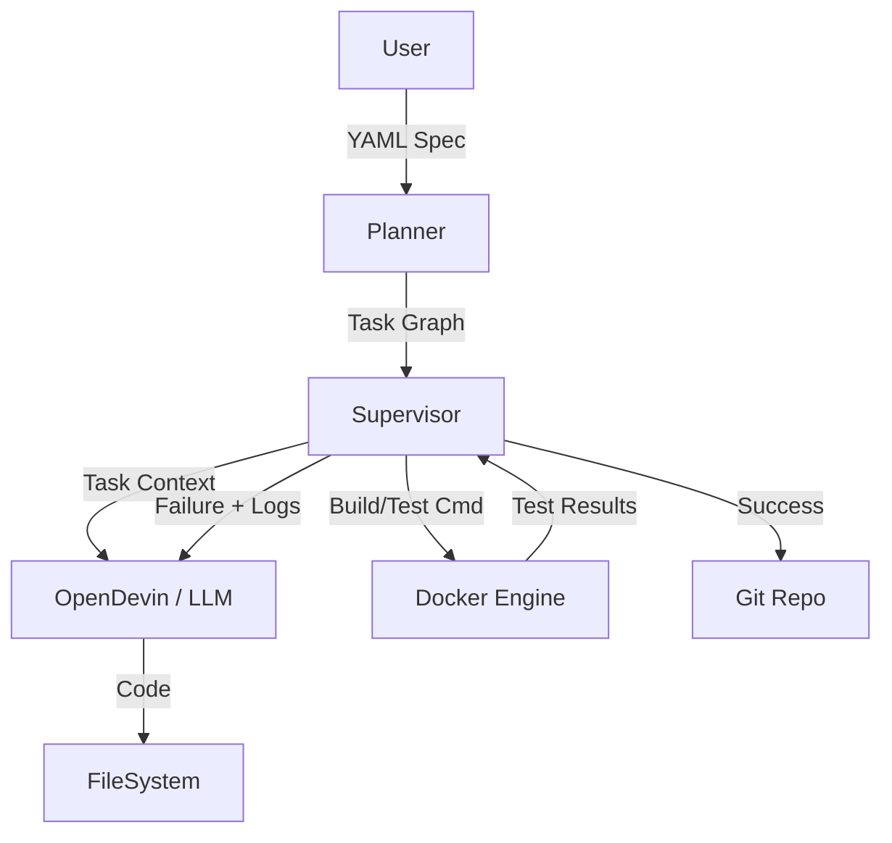

# System Architecture - Auto-Dev Supervisor

## Overview

The `auto-dev` supervisor is designed as a modular, state-machine-driven application that orchestrates the software development lifecycle. It acts as a "manager" that delegates "work" (coding) to an "employee" (OpenDevin/LLM) and verifies the work using standard DevOps tools (Docker, Git).

## Core Components

### 1. Domain Layer (`src/auto_dev_supervisor/domain/`)
- **Models**: Pydantic models (`ProjectSpec`, `Task`, `TestResult`) define the data structures used throughout the system.
- **QA Logic**: `QAManager` encapsulates the logic for evaluating Machine Learning and Audio metrics.

### 2. Core Layer (`src/auto_dev_supervisor/core/`)
- **Planner**: Responsible for parsing the YAML specification and generating a Directed Acyclic Graph (DAG) of tasks. It handles dependency resolution to ensure tasks are executed in the correct order.
- **Supervisor**: The main engine. It runs the control loop:
    1.  **Select Task**: Pick the next pending task whose dependencies are met.
    2.  **Implement**: Call `OpenDevinClient` to generate code.
    3.  **Build & Test**: Call `DockerManager` to spin up containers and run tests.
    4.  **Verify**: Check test results and ML metrics.
    5.  **Fix (Loop)**: If verification fails, feed errors back to `OpenDevinClient` and retry (up to `max_retries`).
    6.  **Commit**: If successful, call `GitManager` to commit changes.

### 3. Infrastructure Layer (`src/auto_dev_supervisor/infra/`)
- **OpenDevinClient**: Abstract base class for the AI worker.
    - `MockOpenDevinClient`: Simulates work for testing/demo.
    - `GenAIOpenDevinClient`: Uses OpenAI API to generate real code.
- **DockerManager**: Wraps the Docker SDK. Generates `docker-compose.yml` dynamically based on the project spec and manages container lifecycles.
- **GitManager**: Wraps `gitpython`. Handles repo initialization, staging, committing (with structured messages), and pushing.

## Data Flow

## Design Decisions

- **Docker-First**: All code execution and testing happens inside containers to ensure isolation and reproducibility.
- **Interface-Based AI**: The `OpenDevinClient` is an interface, allowing us to swap between different LLM providers or mock implementations easily.
- **Strict Quality Gates**: Code is never committed unless all tests and ML metrics pass.
